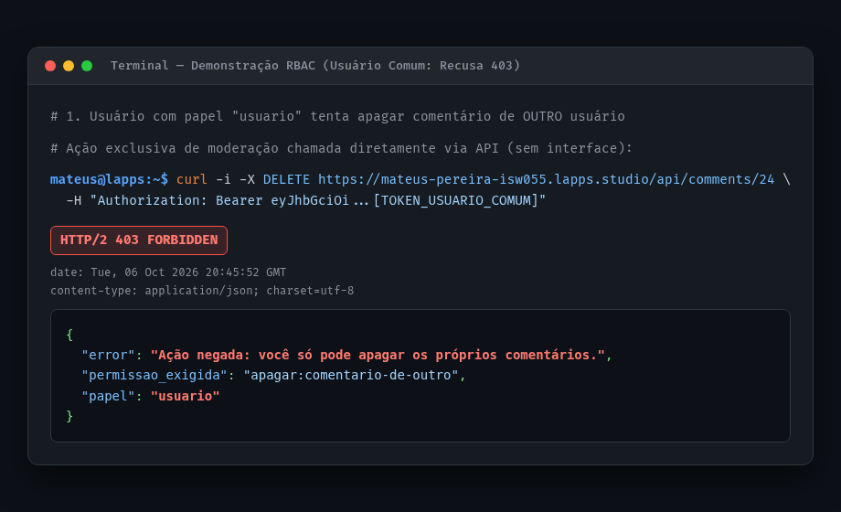
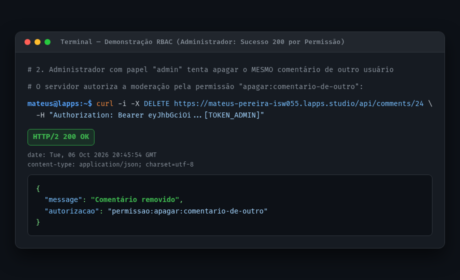
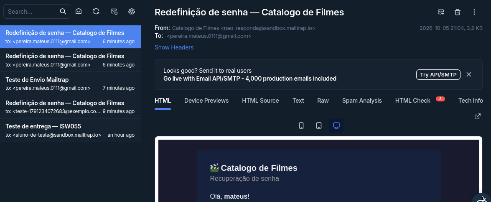
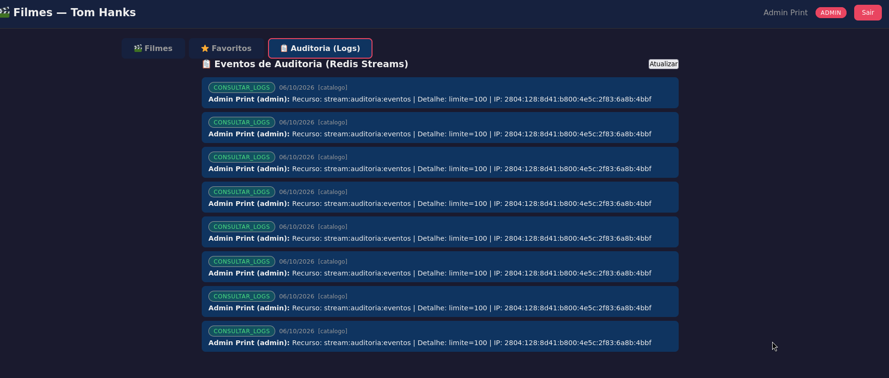
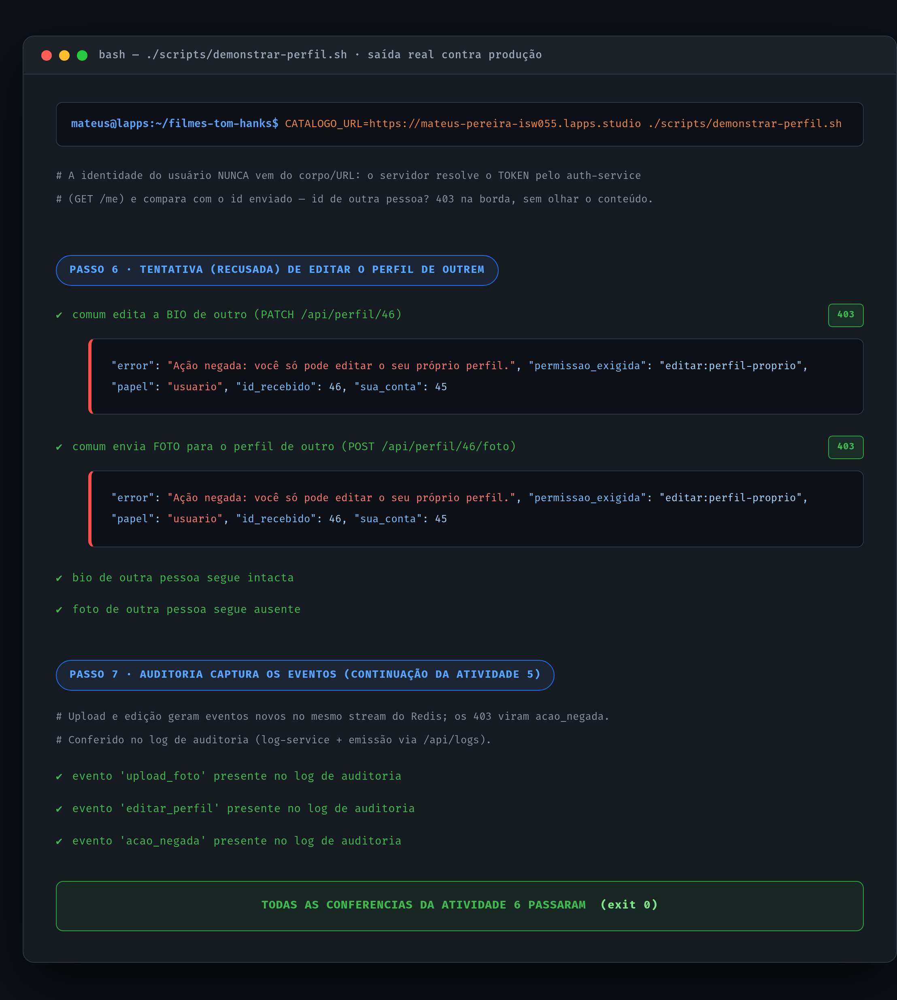
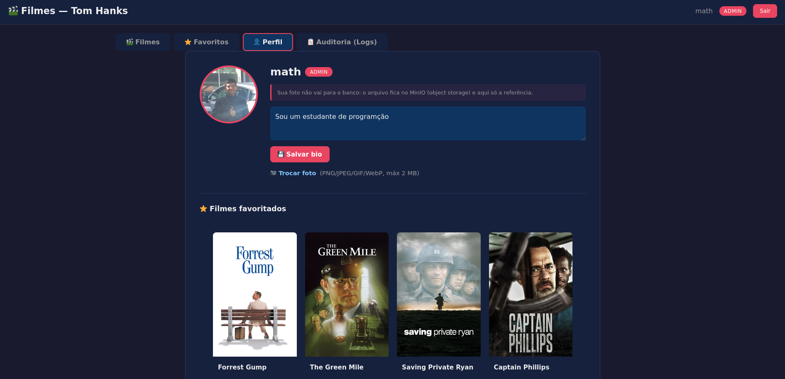

# Catálogo de Filmes — Tom Hanks

Aplicação web que consome a API do TMDB para exibir filmes de Tom Hanks, permitindo que cada usuário favorite e comente seus filmes preferidos.

**Atividade 3 — Serviços desacoplados.** Nesta versão a autenticação saiu do catálogo e virou um microsserviço próprio. O repositório é o mesmo da atividade 2; o que mudou está em [O que mudou](#o-que-mudou).

---

## O que mudou

Na atividade 2 tudo morava num container só: o catálogo tinha a página de login, o cadastro, a emissão do JWT, a validação do token, a consulta da senha e a tabela de usuários. Isso é um **monólito** — para mexer na autenticação era preciso derrubar e republicar a aplicação inteira, e qualquer falha no login derrubava também o catálogo de filmes.

Agora são **dois serviços** que conversam pela rede do Docker:

| | Atividade 2 | Atividade 3 |
|---|---|---|
| Containers | 1 | 2 (`app` + `auth-service`) |
| Autenticação | dentro do catálogo | em um microsserviço separado |
| Segredo do JWT | no catálogo | só no `auth-service` |
| Portas publicadas | 8222 | 8222 (só a do catálogo) |
| Recuperar senha | não existia | e-mail com link de 30 minutos |
| Papéis (role) | não existia | `usuario` e `admin` |

O que **não** mudou: a URL de acesso, o banco de dados, o nome do stack no Portainer e o frontend. Quem tinha conta continua com conta.

Na **atividade 4** o que mudou foi de dentro do código: `admin` deixou de ser um rótulo que só a interface olhava e virou **permissão verificada no servidor**, tanto que uma chamada feita direto por `curl` — sem interface nenhuma — leva **403**. Ver [Papéis e permissões](#papéis-e-permissões) e [Autorização (RBAC)](#autorização-rbac).

```
                      internet
                         │
          ┌──────────────▼───────────────┐
          │  app   (container `app`)      │  ← único ponto de entrada público
          │  porta 8222 publicada         │
          │                               │
          │  catálogo de filmes           │
          │  favoritos · comentários      │
          │  ✗ NÃO valida JWT             │
          │  ✗ NÃO consulta senhas        │
          └──────────────┬───────────────┘
                         │  HTTP pela rede interna do Docker:
                         │  GET  /api/me                 (quem sou eu?)
                         │  POST /api/login
                         │  POST /api/register
                         │  POST /api/forgot-password
                         ▼  http://auth-service:3000
          ┌───────────────────────────────┐
          │  auth-service                 │  ← SEM `ports:`
          │  cadastro · login             │     inalcançável da internet
          │  papéis (role)                │
          │  recuperação de senha         │
          │  guarda o segredo do JWT      │
          └──────────────┬───────────────┘
                         │
          ┌──────────────▼───────────────┐
          │  MariaDB (externo ao compose) │
          │  usuarios, reset_tokens   ← dono: auth-service
          │  favoritos, comentários   ← dono: app
          └──────────────────────────────┘
```

Os dois containers dividilham a rede `interna` (bridge do Docker). Dentro dela o nome `auth-service` resolve para o container do auth-service; fora dela esse nome não existe. É por isso que o link de redefinição de senha volta a entrar pelo catálogo, e nunca pelo auth-service: o navegador do usuário não tem como alcançar um serviço que não publica porta.

### Por que o catálogo não guarda mais o `JWT_SECRET`

Segredo que fica do lado de quem valida não protege nada: qualquer um com acesso ao container do catálogo poderia forjar um token de administrador. Tirar o segredo do catálogo e deixá-lo só no serviço que emite é o que dá consequência prática à separação, e não só diagramas.

### O preço da separação (e por que foi aceito)

O catálogo não valida mais nada sozinho: para saber quem é o usuário, ele faz uma chamada HTTP. Se o `auth-service` estiver fora, tudo que depende de sessão responde **503**, e o catálogo continua no ar servindo o catálogo de filmes.

Essa é uma troca consciente, e é o tipo de coisa que a atividade quer que a gente perceba: **desacoplar de verdade custa uma dependência de rede a mais no caminho crítico**. Se o auth-service cair, ninguém loga — mas ninguém também perde o catálogo. No monólito, uma falha no login derrubava tudo junto.

---

## O `docker-compose.yml` de dois serviços

```yaml
services:
  app:                              # o único container com porta publicada
    build: .
    ports:
      - "8222:8222"
    environment:
      <<: *db                        # mesmo MariaDB da atividade 2
      TMDB_API_KEY: ${TMDB_API_KEY}
      AUTH_SERVICE_URL: http://auth-service:3000
      PORT: "8222"
    depends_on:
      - auth-service
    networks:
      - interna

  auth-service:                     # ✗ sem `ports:` — de propósito
    build: ./auth-service
    environment:
      <<: *db
      NODE_ENV: production
      PORT: "3000"
      JWT_SECRET: ${JWT_SECRET}     # o segredo mora só aqui
      APP_PUBLIC_URL: ${APP_PUBLIC_URL}
      MAIL_HOST: ${MAIL_HOST}
      MAIL_USER: ${MAIL_USER}
      MAIL_PASSWORD: ${MAIL_PASSWORD}
      MAIL_FROM: ${MAIL_FROM}
      # ...
    networks:
      - interna

networks:
  interna:
    driver: bridge
```

O bloco `x-db: &db` é um *anchor* de YAML: as credenciais do MariaDB são escritas uma vez e reaproveitadas pelos dois serviços, para não ficarem duplicadas e divergentes.

### O `auth-service` não publica porta nenhuma

Repare que o serviço `auth-service` **não tem `ports:`**. É o ponto da atividade: o serviço de autenticação existe dentro da rede, e o navegador nunca fala direto com ele.

**Como comprovar:**

```bash
docker compose ps
```

```
NAME                          IMAGE         PORTS
catalogo-app-1                ...           0.0.0.0:8222->8222/tcp
catalogo-auth-service-1       ...           (nada)
```

O `app` aparece com `8222->8222`; o `auth-service` aparece sem nenhuma porta. Só o primeiro é alcançável de fora da máquina.

### Um banco, dois donos

Os dois serviços apontam para o **mesmo** MariaDB (externo ao compose, como na atividade 2), mas cada um é dono de um par de tabelas. A divisão é feita no código, pelo `drizzle.config.ts` do auth-service:

```ts
tablesFilter: ["usuarios", "reset_tokens"]
```

Assim o `db:push` do auth-service nunca toca em `favoritos` e `comentarios`, que são do catálogo. E o inverso também vale: o catálogo não altera mais tabela de ninguém.

---

## Papéis e permissões

Dois papéis: **`usuario`** (padrão, atribuído no cadastro) e **`admin`**. Não existe tela de administração — o papel é um dado da conta.

### O que cada papel pode fazer

A atividade pedia que isso fosse **escrito antes de implementado**: uma permissão que ninguém nomeou não dá para conferir depois. Este é o contrato:

| Permissão | O que permite | `usuario` | `admin` |
|---|---|:-:|:-:|
| `ler:comentario` | ver os comentários de um filme | ✅ | ✅ |
| `criar:comentario` | publicar um comentário | ✅ | ✅ |
| `apagar:comentario` | apagar **o próprio** comentário | ✅ | ✅ |
| `apagar:comentario-de-outro` | apagar o comentário de **qualquer pessoa** | ❌ | ✅ |
| `listar:usuarios` | ver a lista de contas do sistema | ❌ | ✅ |
| `alterar:papel` | promover ou rebaixar outra conta | ❌ | ✅ |

**O que `usuario` pode** é tudo que é dono de si mesmo: ler, comentar, apagar o que escreveu e mexer na própria conta.

**O que `admin` pode além disso** são exatamente três coisas: moderar comentário alheio, enxergar o quadro de contas e trocar o papel de alguém. Não é "admin pode tudo" — `admin` **contém** `usuario` (é um superset, não um conjunto separado), e mesmo um admin não se rebaixa sozinho nem apaga a própria conta.

O mapa inteiro mora em `auth-service/src/auth/permissoes.ts`. É a **única fonte da política**: nenhum outro lugar decide o que um papel pode.

### Como isso chega a quem vai usar

`GET /me` devolve as permissões **já resolvidas**:

```
GET /me  →  { "usuarioId": 6, "nome": "Ana", "role": "usuario",
              "permissoes": ["ler:comentario", "criar:comentario", "apagar:comentario"] }
```

Com isso na mão o catálogo faz `permissoes.includes("apagar:comentario-de-outro")` e **nunca** `role === "admin"`. Essa é a peça que faltava no RBAC: o papel existia, a atribuição existia, mas quem consome a política tem de consumir **permissão**, não o nome do papel.

O papel vem **do banco**, não de dentro do token — promover alguém tem efeito no request seguinte, sem esperar o token de 24h expirar.

Para promover alguém, na atividade 4, existe o script do auth-service (sem endpoint HTTP, para não virar backdoor):

```bash
bun run criar-admin voce@exemplo.com
```

Ou, manualmente:

```sql
UPDATE `usuarios` SET `role` = 'admin' WHERE `email` = 'voce@exemplo.com';
```

E o efeito: o dono de um comentário apaga o seu; um `usuario` que não é dono recebe **403**; um `admin` apaga o de outra pessoa.

---

## Autorização (RBAC)

Ter `role` no banco não autoriza ninguém: papel é **dado**, permissão é **política**, e só a política decide. RBAC tem quatro peças, e as quatro estão nomeadas no código:

| Peça | Onde está |
|---|---|
| Papéis | coluna `role` de `usuarios` (`usuario` e `admin`) |
| Permissões | `auth-service/src/auth/permissoes.ts` — a **única** fonte da política |
| Atribuição | o mapa papel → permissões do arquivo acima (`admin` é superset de `usuario`) |
| Exigência | `exigePermissao()`, rodando **no servidor**, em cada rota protegida |

### A política é aplicada em dois pontos

1. **`auth-service`** — é quem conhece papéis. `listar:usuarios` e `alterar:papel` são conferidos **lá dentro**, antes de qualquer efeito colateral. Um `curl` sem interface nenhuma atravessa o mesmo middleware que a tela.
2. **Catálogo** — para comentários, dono e permissão são **dois `if` separados**: ser autor do comentário **ou** ter `apagar:comentario-de-outro`. Separar os dois é o que deixa legível *por que* veio 403, e não um `if` amontoado que mistura posse com papel.

Esconder botão não é segurança. A interface não mostra o botão porque `permissoes` não contém a permissão — mas se alguém mandar a chamada na mão, quem decide é o servidor, sempre.

### 401 ou 403

| | Significação | Quando acontece |
|---|---|---|
| **401** | *"quem é você?"* | sem token, token inválido ou expirado |
| **403** | *"sei quem é você, e você não pode"* | token válido, permissão ausente |

E `fail-closed` em todo lugar: se o auth-service não responder, o catálogo **recusa** (503) em vez de deixar passar. Nunca o contrário.

### Demonstração (requisito 4)

`scripts/demonstrar-rbac.sh` faz as **duas logins** e joga as duas na **mesma ação exclusiva**, conferindo só o que o servidor diz:

```bash
./scripts/demonstrar-rbac.sh
# ...
# TODAS AS CONFERENCIAS PASSARAM   (exit 0)
```

Apagar o comentário de outra pessoa:

```
usuario (comum)  DELETE /api/comments/<id de outro>   →  403
{"error":"Ação negada: você só pode apagar os próprios comentários.",
 "permissao_exigida":"apagar:comentario-de-outro", "papel":"usuario"}

admin            DELETE /api/comments/<id de outro>   →  200
{"message":"Comentário removido", "autorizacao":"permissao:apagar:comentario-de-outro"}
```

#### Comprovação prática (Prints dos dois casos):

**1. Usuário comum tentando apagar comentário de outro usuário — Recusado com HTTP 403 Forbidden:**



**2. Administrador tentando a mesma ação exclusiva — Autorizado com HTTP 200 OK via permissão de moderação:**




Resto da grade:

| Cenário | Esperado | Obtido |
|---|:-:|:-:|
| `usuario` → `GET /api/usuarios` | 403 | 403 |
| `admin` → `GET /api/usuarios` | 200 | 200 |
| admin se rebaixar sozinho | 400 | 400 |
| papel inventado no cadastro | 400 | 400 |
| requisição sem token | 401 | 401 |

> O script parseia JSON com `bun`, nunca com `grep`: uma versão em `grep` devolvia string vazia para campo numérico (`"usuarioId":29`, sem aspas) e transformava bug do script em bug da API.

### Qual padrão o auth-service usa hoje (requisito 5)

**Padrão A — decisão centralizada.** Quem decide é o auth-service, e o texto do README já diz isso sem rodeio: *"o catálogo não valida mais nada sozinho: para saber quem é o usuário, ele faz uma chamada HTTP"*. É a consequência direta de o catálogo **não** ter mais o `JWT_SECRET` — sem o segredo ele nem poderia ler o token localmente, muito menos extrair uma claim dele. `GET /me` devolve `permissoes` já resolvidas, e é essa chamada que alimenta a interface.

Se mudássemos para o **padrão B** (decisão local a partir de claims do JWT), seriam três mudanças:

1. **Escrever `role`/`permissoes` no payload** do token na hora do login — a claim passa a ser a fonte, não a chamada.
2. **Trocar a chamada por decodificação local** em `exigePermissao()`: a assinatura confere, lê a claim, decide — zero salto de rede por decisão.
3. **Aceitar a perda de propagação imediata.** Hoje `UPDATE usuarios SET role = 'admin'` vale no request seguinte; com B, vale quando o token de 24h expirar. Promover alguém passa a demorar até um dia — e **rebaixar também**, que é o lado que custa em segurança: um admin rebaixado continua admin até o token vencer.

A troca ganha latência e perde revogação instantânea. Como o requisito do trabalho é justamente mostrar que a autorização é decidida **no servidor**, e o `403` por `curl` é a prova disso, o padrão A é o que está em uso — e a resposta acima é análise, sem implementação nenhuma, como pedido.

---

## Recuperação de senha

### A tabela `reset_tokens`

```sql
CREATE TABLE `reset_tokens` (
  `id`         int AUTO_INCREMENT NOT NULL,
  `token`      varchar(64) NOT NULL,   -- 32 bytes aleatórios em hexadecimal
  `usuario_id` int NOT NULL,           -- de quem é o link
  `criado_em`  timestamp NOT NULL,     -- quando o link foi gerado
  `expira_em`  timestamp NOT NULL,     -- criado_em + 30 minutos
  `usado`      boolean NOT NULL DEFAULT false,
  PRIMARY KEY (`id`),
  UNIQUE (`token`),
  FOREIGN KEY (`usuario_id`) REFERENCES `usuarios` (`id`)
);
```

`criado_em` e `expira_em` são calculados pelo **banco** (`NOW()` e `DATE_ADD(NOW(), INTERVAL 30 MINUTE)`), não pelo container. Se o relógio do container e o do MariaDB divergirem, o prazo continua correto.

### As três validações do link

Quando alguém abre o link, o auth-service confere **três** coisas. Qualquer uma que falhe, a senha não muda:

| # | Verificação | Se falhar |
|---|-------------|-----------|
| 1 | o token existe? | `400` — *"Link inválido. Peça um novo link de recuperação de senha."* |
| 2 | ainda não passou de `expira_em`? | `400` — *"Este link expirou (válido por 30 minutos). Peça um novo link."* |
| 3 | ainda não foi usado? | `400` — *"Este link já foi utilizado. Peça um novo link..."* |

O consumo do token é atômico — um `UPDATE ... WHERE usado = 0`. Se duas pessoas clicarem no mesmo link no mesmo segundo, só uma consegue; a outra cai na verificação 3.

### E-mail de verdade: Mailtrap (dev) e Brevo (prod)

O envio é real via SMTP (nodemailer) — o e-mail chega na caixa de entrada, não aparece na tela.

| | Desenvolvimento | Produção |
|---|---|---|
| Serviço | **Mailtrap** (Email Sandbox) | **Brevo** (envio real, camada gratuita) |
| Host | `smtp.mailtrap.io` (ou `sandbox.smtp.mailtrap.io`) | `smtp-relay.brevo.com` |
| Porta | `2525` | `587` |
| Entrega | chega na inbox da sua conta Mailtrap | chega no e-mail real do usuário |

Os dois hosts do Mailtrap são o mesmo serviço e ambos funcionam — a tela do
sandbox nowadays mostra `sandbox.smtp.mailtrap.io`, mas `smtp.mailtrap.io`
continua válido. O que é diferente entre eles é o **par usuário/senha**: o
sandbox tem credenciais próprias, geradas na tela **Settings / Integrations →
SMTP** do seu sandbox, que *não* são o API token da conta. Token de API não
funciona como credencial SMTP — dá `535 Invalid credentials`.

O código é o mesmo nas duas: muda só o destino. Para alternar, troque o bloco correspondente no `.env`.

No sandbox do Mailtrap, o remetente (`MAIL_FROM`) deve ser o endereço que a
própria tela do sandbox oferece. E-mail de exemplo (`catalogo@exemplo.com`) não
serve. Se o envio for recusado, o log do container traz o motivo exato do SMTP.

Para conferir as credenciais sem enviar e-mail nenhum (não gasta a cota do
sandbox), no console do container:

```bash
docker compose exec auth-service bun -e "
import nodemailer from 'nodemailer';
const t = nodemailer.createTransport({host:process.env.MAIL_HOST,port:+process.env.MAIL_PORT,secure:false,auth:{user:process.env.MAIL_USER,pass:process.env.MAIL_PASSWORD}});
await t.verify();
console.log('SMTP OK');
"
```

### Passo a passo da demonstração

#### 1. Pedido de recuperação de senha no catálogo
O usuário acessa o formulário **"Esqueci minha senha"** no catálogo e informa seu e-mail cadastrado:


#### 2. E-mail recebido no Mailtrap (Sandbox)
O microsserviço de autenticação (`auth-service`) dispara o e-mail via SMTP com o token único de 30 minutos, interceptado com sucesso pelo Mailtrap:



3. **Clique no link**: O navegador abre `/reset-password?token=...` no catálogo com o formulário de nova senha.
4. Troque a senha e faça login com a nova. **Funcionou.**


Para a **tentativa recusada**, use o mesmo link mais de uma vez:

- **Token já usado:** repita o passo 5 com o mesmo token → `400`, *"Este link já foi utilizado"*.
- **Token expirado:** faça o passo 5 mais de 30 minutos depois → `400`, *"Este link expirou"*. Sem esperar 30 minutos para provar na demonstração, suba o container com `RESET_TOKEN_TTL_MINUTES=1` e mostre o mesmo resultado em 1 minuto — a lógica de expiração é a mesma, e a mensagem muda junto ("válido por 1 minuto").
- **Token inválido:** abra `/reset-password?token=inventado` → `400`, *"Link inválido"*.

Existe um script que roda a parte automatizada disso:

```bash
./scripts/verificar-fluxo.sh          # fase 1: cadastro, login, papéis, e-mail
./scripts/verificar-fluxo.sh fase2   # fase 2: usa o link e prova a recusa
```

---

## Segurança — o que foi levado a sério

- **Sem enumeração de usuário.** O "esqueci minha senha" responde `200` com a mesma mensagem tanto para um e-mail cadastrado quanto para um e-mail inventado. Caso contrário, dava para usar o formulário para descobrir quem tem conta no sistema.
- **Token de uso único e atômico.** Descrito acima.
- **Segredo fora do catálogo.** Ver [aqui](#por-que-o-catálogo-não-guarda-mais-o-jwt_secret).
- **Só o último pedido vale.** Pedir a recuperação de novo apaga o token pendente anterior.

**O que daria para endurecer e não foi feito** (anotado de propósito, porque esconder essas escolhas seria enganoso):

- O `token` é gravado em texto puro no banco. O mais defensável seria guardar apenas o hash do token e mandar o valor original por e-mail — assim, quem lê o banco não consegue forjar links. A tabela pedida na atividade tem a coluna `token`, então segui a especificação.
- Não há limite de tentativas por IP no "esqueci minha senha" nem no login.
- O JWT continua sem revogação: trocar a senha não derruba as sessões já abertas.

---

## Tecnologias

- **Runtime**: Bun
- **Backend**: Hono (nos dois serviços)
- **Database**: MariaDB + Drizzle ORM
- **Auth**: JWT + bcrypt, **dentro do auth-service**
- **E-mail**: nodemailer (SMTP)
- **Deploy**: Docker + Portainer

---

## Deploy no Portainer

### 1. Migration do banco (só se ela ainda não tiver sido aplicada)

O `auth-service` precisa da coluna `role` em `usuarios` e da tabela `reset_tokens`. **Se o banco já estiver no estado da atividade 3, pule este passo.**

A forma de saber é deployar e olhar o container: o `auth-service` confere o próprio schema no boot, e o `/health` responde `503` se faltar algo. Deploy com o schema errado não quebra nada — o catálogo continua no ar, e só o que depende de sessão dá erro até a migration rodar.

Se o `/health` responder `200`, acabou. Se responder `503`, rode a migration:

Abra o **console do container** `auth-service` no Portainer:

```bash
bun run db:migrate
```

```
[migrate] alvo: catalogo@SEU_HOST:3306/SEU_BANCO
[migrate] 3 comando(s) em sql/atividade-3.sql
  [aplicado]  ALTER TABLE `usuarios`
  [aplicado]  CREATE TABLE `reset_tokens` (
  [aplicado]  CREATE INDEX `reset_tokens_usuario_idx` ...
[migrate] pronto — coluna `role` e tabela `reset_tokens` criadas.
```

Ou, a partir da máquina que tem o Docker, com o `.env` local preenchido:

```bash
docker compose run --rm auth-service bun run db:migrate
```

O script é idempotente: rodar duas vezes não faz estrago, e se a aplicação falhar no meio ele completa o que falta.

> O usuário do banco precisa de permissão de `ALTER` e `CREATE`. A migration não apaga nem altera dados existentes — todos os usuários atuais nascem com `role = 'usuario'`.
>
> Se a migration não tiver sido aplicada, o serviço avisa no log na partida e o `/health` responde `503`, então o container aparece como **unhealthy** no Portainer, em vez de falhar só quando alguém tenta logar.

### 2. Variáveis de ambiente

As mesmas da atividade 2, mais as do novo serviço:

| Variável | Serviço | Valor |
|----------|---------|-------|
| `TMDB_API_KEY` | app | o mesmo de antes |
| `AUTH_SERVICE_URL` | app | `http://auth-service:3000` (já vem no compose) |
| `AUTH_SERVICE_TIMEOUT_MS` | app | opcional, padrão `5000` |
| `DB_HOST` `DB_PORT` `DB_USER` `DB_PASSWORD` `DB_NAME` | os dois | os mesmos de antes |
| `JWT_SECRET` | **só o auth-service** | **mantenha o mesmo** — trocar desloga todo mundo |
| `JWT_EXPIRES_IN` | auth-service | `24h` |
| `APP_PUBLIC_URL` | auth-service | **a URL que você abre no navegador**, ex. `https://seu-subdominio/` |
| `RESET_TOKEN_TTL_MINUTES` | auth-service | `30` |
| `MAIL_HOST` `MAIL_PORT` `MAIL_USER` `MAIL_PASSWORD` `MAIL_FROM` | auth-service | Mailtrap (dev) ou Brevo (prod) |
| `MAIL_FROM_NAME` | auth-service | `Catálogo de Filmes` |

`APP_PUBLIC_URL` é a mais fácil de errar e a mais importante: é por ela que o link de redefinição é montado. Se o e-mail chega com link quebrado, é esse valor.

### 3. Atualizar o stack

"Update the stack", com rebuild — os dois containers mudaram.

**Não é preciso** criar rede, criar volume, mudar o proxy ou abrir porta. A rede `interna` é criada pelo próprio compose, e o proxy reverso continua apontando para `8222`: o auth-service não publica porta, então não há o que configurar para ele.

### Rodando localmente

```bash
cp .env.example .env          # preencha
bun install
cd auth-service && bun install && cd ..
docker compose up --build
```

Sem Docker, dá para subir os dois em terminais separados:

```bash
# terminal 1 — auth-service (porta 3000)
cd auth-service && bun run dev

# terminal 2 — catálogo (porta 8222)
AUTH_SERVICE_URL=http://localhost:3000 bun run dev
```

### Conferindo que está tudo certo

```bash
# 1. o catálogo responde
curl -s localhost:8222/login | head -1

# 2. o auth-service responde, de dentro da rede do Docker
docker compose exec app bun -e "fetch('http://auth-service:3000/health').then(r=>r.text()).then(console.log)"

# 3. o fluxo inteiro, automatizado
./scripts/verificar-fluxo.sh
```

---

## Estrutura do projeto

```
.
├── docker-compose.yml        quatro serviços + a rede interna
├── src/                      container `app` — o catálogo
│   ├── index.ts
│   ├── middleware/auth.ts    pergunta ao auth-service quem é o usuário
│   ├── middleware/permissao.ts  exigePermissao() da atividade 4
│   ├── middleware/auditoria.ts  intercepta 403 e registra acao_negada (atividade 5)
│   ├── routes/auth.ts        gateway: só repassa para o auth-service
│   ├── routes/comments.ts    comentar · apagar (moderação) → emitem eventos
│   ├── routes/favorites.ts   favoritar · desfavoritar → emitem eventos
│   ├── routes/logs.ts        GET /api/logs — consulta só-admin (atividade 5)
│   ├── services/
│   │   ├── auth-service.ts   cliente HTTP do auth-service
│   │   └── log-service.ts    cliente HTTP do log-service (eventos + consulta)
│   ├── db/                   schema e migrations do catálogo
│   └── public/               frontend (login, catálogo, /reset-password)
│
├── auth-service/             container `auth-service` — contexto de build próprio
│   ├── Dockerfile
│   ├── drizzle.config.ts     tablesFilter: só as tabelas deste serviço
│   ├── sql/atividade-3.sql   a migration
│   └── src/
│       ├── index.ts
│       ├── config.ts         variáveis de ambiente, validadas na partida
│       ├── mail.ts           envio via SMTP
│       ├── auth/permissoes.ts   o mapa de permissões (RBAC) — único dono
│       ├── middleware/autorizar.ts  401/403 do próprio auth-service
│       ├── routes/auth.ts    register · login · me · logout (emite eventos)
│       ├── routes/password.ts forgot-password · reset-password
│       ├── routes/usuarios.ts  listar usuários · alterar papel (emite eventos)
│       └── services/
│           ├── reset-token.ts   gerar · validar · consumir o token
│           └── log-service.ts   cliente HTTP do log-service (eventos)
│
├── log-service/              container `log-service` — contexto de build próprio
│   ├── Dockerfile
│   └── src/
│       ├── index.ts          GET /health
│       ├── config.ts         variáveis de ambiente, validadas na partida
│       ├── eventos.ts        formato e validação do evento de auditoria
│       ├── redis.ts          XADD (MAXLEN ~) · XREVRANGE · /health do Redis
│       ├── autorizacao.ts    pergunta ao auth-service se tem consultar:logs
│       └── rotas/
│           ├── eventos.ts    POST /eventos — porta de entrada da auditoria
│           └── logs.ts       GET /logs — consulta só-admin (401/403/503)
│
└── scripts/
    ├── verificar-fluxo.sh
    ├── demonstrar-rbac.sh            atividade 4
    └── demonstrar-auditoria.sh       atividade 5
```

O `auth-service` tem contexto de build próprio: ele **não** está dentro da imagem do catálogo, e o `.dockerignore` da raiz exclui a pasta dele do build do `app`. São duas unidades de deploy separadas, como deve ser.

---

## Atividade 5 — Observabilidade e Auditoria (log-service + Redis Streams)

Nesta atividade, o sistema ganha um novo microsserviço dedicado à **auditoria e observabilidade**: o `log-service`, conectado a uma instância do **Redis** utilizando **Streams** (`XADD` e `XREVRANGE`).

### Arquitetura de Observabilidade

```
                     internet
                        │
         ┌──────────────▼───────────────┐
         │  app   (catálogo na 8222)    │  ← único exposto à internet
         └───────┬──────────────┬───────┘
                 │              │
    HTTP /me     │              │ POST /eventos (fail-open)
                 ▼              ▼
   ┌─────────────────┐    ┌─────────────────────────────────┐
   │  auth-service   │    │  log-service (porta 3000 interna│
   │  (privado)      ├────►  sem ports:, rede interna)      │
   └─────────────────┘    └────────────────┬────────────────┘
       POST /eventos                       │ XADD (MAXLEN ~ 50000)
                                           ▼
                                  ┌─────────────────┐
                                  │ Redis (Streams) │
                                  └─────────────────┘
```

### O `docker-compose.yml` com o `log-service` e o `Redis` adicionados

Os dois serviços novos seguem o **mesmo princípio do auth-service da atividade 3: nenhum dos dois publica porta no host**. Quem consulta o log-service é o catálogo, por dentro da rede `interna` — um endpoint público de auditoria seria um serviço expondo "quem fez o quê" para a internet inteira.

```yaml
  # ---------------------------------------------------------------------------
  # REDIS — armazenamento do stream de auditoria (atividade 5). NAO tem `ports:`.
  # ---------------------------------------------------------------------------
  redis:
    image: redis:7-alpine
    command: redis-server --appendonly yes
    networks:
      - interna
    healthcheck:
      test: ["CMD", "redis-cli", "ping"]
      interval: 5s
      timeout: 3s
      retries: 5
    restart: always

  # ---------------------------------------------------------------------------
  # LOG-SERVICE — microsservico de auditoria e observabilidade. NAO tem `ports:`.
  # ---------------------------------------------------------------------------
  log-service:
    build: ./log-service
    environment:
      NODE_ENV: production
      PORT: "3000"
      REDIS_URL: ${REDIS_URL:-redis://redis:6379}
      REDIS_STREAM: ${REDIS_STREAM:-auditoria:eventos}
      REDIS_STREAM_MAXLEN: ${REDIS_STREAM_MAXLEN:-50000}
      AUTH_SERVICE_URL: http://auth-service:3000
      PERMISSAO_LEITURA: consultar:logs
      LOG_INGEST_TOKEN: ${LOG_INGEST_TOKEN:-}
    depends_on:
      redis:
        condition: service_healthy
      auth-service:
        condition: service_started
    networks:
      - interna
    healthcheck:
      test:
        - CMD
        - bun
        - -e
        - "fetch('http://localhost:3000/health').then(r=>process.exit(r.ok?0:1)).catch(()=>process.exit(1))"
      interval: 30s
      timeout: 5s
      retries: 3
    restart: always
```

`redis` e `log-service` **não têm bloco `ports:`** — como no auth-service, `docker compose ps` só mostra o catálogo com porta publicada. Tanto `app` quanto `auth-service` ganharam dois campos para se comunicarem com o novo serviço pela rede interna:

```yaml
      LOG_SERVICE_URL: ${LOG_SERVICE_URL:-http://log-service:3000}
      LOG_INGEST_TOKEN: ${LOG_INGEST_TOKEN:-}
```

`LOG_SERVICE_URL` é o endereço do log-service **dentro da rede do Docker** (nome do serviço, nunca `localhost`), e `LOG_INGEST_TOKEN` é o segredo compartilhado opcional para escrever eventos (header `X-Log-Token`).

### Por que Redis Streams (`XADD`) em vez de listas (`LPUSH`)

1. **Ordenação cronológica e IDs temporais nativos:** Cada evento no Stream recebe um ID com timestamp de milissegundos (`<milissegundos>-<sequência>`), garantindo que os eventos nunca sofram inversão de ordem.
2. **Campos chave-valor estruturados:** O Stream aceita diretamente pares de campo/valor (`acao`, `usuario_id`, `usuario`, `papel`, `recurso`, `detalhe`, `ip`, `origem`, `timestamp`), sem a necessidade de re-parsear payloads opacos.
3. **Capping aproximado eficiente (`MAXLEN ~ 50000`):** Ao limitar o tamanho com o modificador `~`, o Redis descarta nós inteiros da árvore de rasteio apenas quando oportuno, tornando a gravação de cada log estritamente $O(1)$ sem custo de compactação pesada.
4. **Pronto para mensageria assíncrona:** Streams oferecem *Consumer Groups* nativos, permitindo que outros microsserviços processem auditoria sem onerar a aplicação principal.

### Decisões de Design e Resiliência

* **Gravação Fail-Open:** O envio de eventos para o `log-service` nunca bloqueia ou falha uma requisição de negócio do usuário. Se o Redis ou o `log-service` estiverem temporariamente indisponíveis, o erro é registrado no log local e a ação (ex: favoritar ou comentar) continua com sucesso.
* **Leitura Fail-Closed:** Apenas administradores com a permissão `consultar:logs` podem ler os registros via `GET /api/logs`. Sem token ou sem permissão, o acesso é barrado com `401` ou `403`.
* **Rastreamento de IP e Origem:** O catálogo repassa o IP do cliente (`X-Forwarded-For` ou `CF-Connecting-IP`) e a origem do evento (`catalogo` ou `auth-service`).

### Eventos Auditados

* `login` e `login_falhou` (com detalhe do e-mail tentado)
* `logout` (sessão voluntariamente encerrada)
* `favoritar` e `desfavoritar` (filmes)
* `comentar` e `apagar_comentario`
* `alterar_papel` (promoção/rebaixamento de usuários)
* `acao_negada` (interceptação automática de qualquer tentativa bloqueada com HTTP 403)

### Demonstração Prática

Para rodar a verificação automatizada completa da auditoria:

```bash
# Localmente:
./scripts/demonstrar-auditoria.sh

# Contra o ambiente de produção:
CATALOGO_URL=https://mateus-pereira-isw055.lapps.studio ./scripts/demonstrar-auditoria.sh
```

### Print da consulta de logs como admin

Com o catálogo aberto como admin (permissão `consultar:logs` no mapa do auth-service), a aba **📋 Auditoria (Logs)** lista os últimos 100 eventos do stream, em ordem cronológica — o mais antigo primeiro:



O que o print mostra:

* **Badge vermelho** = alerta de segurança: `acao_negada` (403 da atividade 4 interceptado) e `login_falhou` (tentativa de login com credenciais inválidas)
* **Badge verde** = ação normal: `login`, `logout`, `favoritar`, `comentar`, `consultar_logs`
* **Origem** diz qual serviço reportou: o `auth-service` manda os eventos de sessão (login/logout), o catálogo manda os de conteúdo (favoritar/comentar) — os dois passam pelo `log-service`, que é o único a gravar no Redis Streams
* A consulta em si também é auditada: um evento `consultar_logs` aparece na leitura **seguinte** — prova de que a ordem do stream está correta, já que uma leitura não pode aparecer antes dela mesma

---

## Atividade 6 — Armazenamento de objetos (foto de perfil + MinIO)

Nesta atividade o catálogo vira uma **rede social**: cada usuário ganha uma página de perfil (nome, foto, bio curta e a lista de favoritos — o dado da atividade 2). A **foto** é o centro da novidade: o arquivo vai para um **MinIO** dedicado a este projeto, e o MariaDB guarda **só a referência** (a chave do objeto).

```
            navegador                     catálogo                     MinIO
 ┌───────────────────────┐      ┌────────────────────────┐     ┌───────────────┐
 │   POST /api/perfil/:id/foto  │  valida tipo/tamanho  │     │  bucket privado│
 │   (multipart, foto.png) ──────►  bytes ────────────────►   │  perfis/       │
 │                        │      │  (nunca BLOB no DB)  │     │  <id>/avatar-*.png
 │   GET /api/perfil/:id/foto ◄───┤  lê bytes de volta   ◄─────┤               │
 └───────────────────────┘      │  ├─ MariaDB: só a      │     └───────────────┘
                                │  │   chave em `perfis` │
                                │  └─ favoritos/bio      │
                                └────────────────────────┘
```

### A decisão: bucket **privado** com exibição controlada pelo catálogo

O enunciado pede para decidir entre **bucket de leitura pública** (mais simples) ou **URL pré-assinada/temporária** (mais controlada). A escolha aqui foi a **variante mais controlada**, com um ajuste de arquitetura:

* O MinIO **não publica porta** — mesma regra do auth-service e do log-service (atividades 3 e 5). O navegador só conhece o catálogo.
* O bucket `perfis` é **privado**: nenhum objeto é legível sem credencial.
* Quem entrega os bytes ao navegador é a rota de leitura **autenticada** `GET /api/perfil/:id/foto` do catálogo — na prática, a "assinatura" da URL é a **sessão** (token JWT válido no header), e a URL expira com ela.
* No navegador, a foto **não** entra por `background-image` apontando para a URL: um ``/CSS não mandaria o header `Authorization` e a rota responderia `401`. A página busca os bytes com `fetch(token)` e monta uma **`blob:` URL** no avatar — o header só existe na memória da aba, e a foto nunca vira um link público no DOM.

**Trade-off assumido:** um bucket público exigiria expor o MinIO na internet (contradizendo o "um único ponto de entrada" construído nas atividades anteriores), serviria por `http` e quebraria como *mixed content* no site `https`. Uma URL pré-assinada de verdade teria o mesmo problema: ela aponta **para o host do MinIO**, que não existe publicamente. A rota do catálogo dá o mesmo resultado (um link temporário, não-enumerável, com expiração) sem abrir o armazenamento — o binário fica privado e a referência no MariaDB é só a chave.

### Nota importante (out/2026): o MinIO foi arquivado

O MinIO open-source foi **arquivado** em abril/2026 e as imagens oficiais `minio/minio` **saíram dos registries** (Docker Hub e Quay retornam 404; `dl.min.io` devolve 410 Gone). As imagens pré-compiladas que continuam existindo são **reempacotamentos comunitários do mesmo código upstream**. Este projeto usa `elestio/minio` — a mesma imagem que outras disciplinas desta série já usam — correspondente à **última release open-source** (RELEASE.2025-10-15). O servidor continua sendo MinIO de verdade (mesma API S3). A mitigação da CVE conhecida dessa última release é estrutural: o MinIO não publica porta, e a única conversa com ele vem do catálogo, pela rede interna.

### O `docker-compose.yml` com o MinIO adicionado

```yaml
  # ---------------------------------------------------------------------------
  # MINIO — object storage da foto de perfil (atividade 6). NAO tem `ports:`.
  # O arquivo (a foto) mora aqui; no MariaDB fica so a chave. Mesmo principio
  # do auth-service/log-service: invisivel para a internet, so o catalogo fala
  # com ele pela rede `interna`.
  # ---------------------------------------------------------------------------
  minio:
    image: elestio/minio:latest
    command: server /data --console-address :9001
    environment:
      MINIO_ROOT_USER: ${MINIO_ROOT_USER:-isw055-mateus}
      MINIO_ROOT_PASSWORD: ${MINIO_ROOT_PASSWORD:-e3316f32df8692e0ee4571fc7524465e}
    volumes:
      - minio-data:/data
    networks:
      - interna
    restart: always
```

E o catálogo (`app`) ganha as variáveis do cliente:

```yaml
      MINIO_ENDPOINT: ${MINIO_ENDPOINT:-http://minio:9000}
      MINIO_ROOT_USER: ${MINIO_ROOT_USER:-isw055-mateus}
      MINIO_ROOT_PASSWORD: ${MINIO_ROOT_PASSWORD:-e3316f32df8692e0ee4571fc7524465e}
      MINIO_BUCKET: ${MINIO_BUCKET:-perfis}
```

* O volume `minio-data` garante que as fotos sobrevivam a `docker compose down/up`.
* No boot, o catálogo cria o bucket (com retry) sem travar a subida: se o MinIO estiver fora do ar, o catálogo sobe e passa a recusar upload com `503` claro até o armazenamento voltar.

### Migration: a tabela `perfis` (só a referência, nunca o binário)

Como nas atividades anteriores, **não** se usa `db:push` contra o banco de produção. A migration é um arquivo SQL versionado (`sql/atividade-6.sql`) aplicado por script idempotente:

```bash
bun run db:migrate                            # ambiente local
bun --env-file=.env.portainer run db:migrate  # contra o banco de produção
```

```sql
CREATE TABLE IF NOT EXISTS perfis (
  usuario_id   INT NOT NULL,
  bio          TEXT NULL,
  foto_chave   VARCHAR(255) NULL,     -- a CHAVE do objeto no MinIO
  atualizado_em TIMESTAMP NOT NULL DEFAULT CURRENT_TIMESTAMP ON UPDATE CURRENT_TIMESTAMP,
  PRIMARY KEY (usuario_id),
  CONSTRAINT fk_perfis_usuario FOREIGN KEY (usuario_id) REFERENCES usuarios(id)
) ENGINE=InnoDB DEFAULT CHARSET=utf8mb4 COLLATE=utf8mb4_unicode_ci;
```

A foto em si nunca vira BLOB: o MariaDB recebe **apenas a chave do objeto** (`perfis/<id>/avatar-<ts>.ext`, ≤ 255 caracteres). Um avatar inteiro fica no disco do MinIO, e o banco continua leve."

### Upload validado (tipo e tamanho)

A ordem das validações importa — e cada uma recusa antes do custo da próxima:

1. **Dono do perfil** → `403` se o `id` da URL não for o dono do token (regra da atividade 4).
2. **Content-Type** `image/*` → senão `415`.
3. **Tamanho ≤ 2 MB** → senão `413`.
4. **Magic bytes** (PNG `\x89PNG`, JPEG `\xFF\xD8\xFF`, GIF `GIF8`, WebP `RIFF…WEBP`) → senão `415`. Não confiamos no header do navegador: um arquivo renomeado para `.png` é pego pelos bytes.

Só depois disso o binário vai para o MinIO, o **objeto antigo é removido** (o bucket não acumula lixo) e a nova chave entra em `perfis`. A chave é versionada: `perfis/<usuarioId>/avatar-<timestamp>.<ext>` — a URL muda a cada upload, então o navegador nunca mostra foto velha de cache.

### Cada um edita só o próprio perfil (a regra da atividade 4 aplicada a um recurso novo)

O backend **não confia no ID do corpo nem da URL**: a identidade vem do token (resolvida pelo auth-service no `GET /me`). `PATCH /api/perfil/:id` e `POST /api/perfil/:id/foto` comparam `id` com o `usuarioId` da sessão — mandou id de outra pessoa, devolve `403` na borda, sem nem olhar o conteúdo:

```json
{"error":"Ação negada: você só pode editar o seu próprio perfil.",
 "permissao_exigida":"editar:perfil-proprio","papel":"usuario",
 "id_recebido":37,"sua_conta":36}
```

* **Ver** o perfil de outra pessoa é leitura comum de rede social — qualquer usuário logado pode (`GET /api/perfil/:id`), e o **nome** vem do auth-service por um endpoint novo (`GET /usuarios/:id/perfil-publico`, autenticado, que nunca devolve e-mail). Clicar no autor de um comentário abre o perfil dele.
* **Editar/fotografar** é exclusivo do dono — os dois `403` acima são também **auditados** automaticamente como `acao_negada` (middleware da atividade 5).

### Auditoria (continuação da atividade 5)

Dois eventos novos entram no mesmo stream do Redis: `editar_perfil` (com nº de caracteres) e `upload_foto` (com formato e tamanho). Os `403` de edição alheia já eram capturados como `acao_negada`.

### Demonstração automatizada

```bash
./scripts/demonstrar-perfil.sh                  # local
CATALOGO_URL=https://mateus-pereira-isw055.lapps.studio ./scripts/demonstrar-perfil.sh
```

O script cria duas contas, monta o perfil de uma (bio + upload da foto `scripts/fixtures/avatar-teste.png`), prova que a foto volta **byte a byte** (md5 idêntico), testa as recusas `415`/`413`, tenta **editar o perfil da outra pessoa** (403, com o perfil dela intacto depois) e confere os eventos `upload_foto`, `editar_perfil` e `acao_negada` no log de auditoria:



### Print do perfil com a foto de upload aparecendo

Com o catálogo aberto (logado como o usuário de demonstração), a aba **👤 Perfil** mostra a página pessoal: avatar com a foto enviada, badge de papel, bio editável e a grade de **favoritos** da atividade 2:



O print mostra:

* **Foto de upload de verdade** — o arquivo saiu do disco, passou pelas validações, foi parar no MinIO e voltou pelos bytes serviados pelo catálogo (`GET /api/perfil/:id/foto`), não um link quebrado
* **Bio salva** e aviso de que o binário não mora no banco
* **Favoritos da atividade 2** na mesma página — o perfil é a soma do dado novo (foto/bio) com o dado que já existia
* A tentativa de editar o perfil alheio foi demonstrada no script acima com `403` (`permissao_exigida: "editar:perfil-proprio"`), que também aparece no log de auditoria como `acao_negada`

---

## Professor

Disciplina ministrada por **@siriani** — <https://github.com/siriani>.

